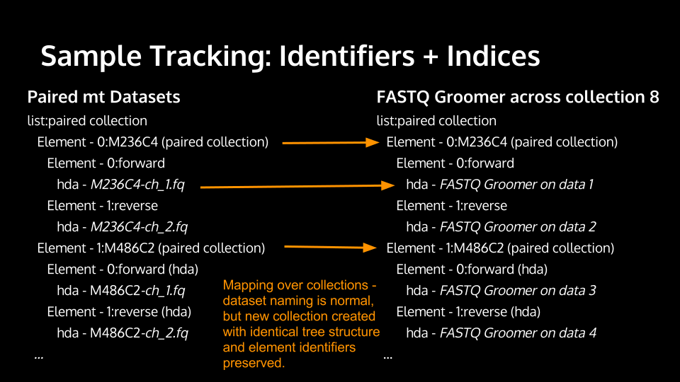

Collections
==============================

Galaxy has a concept of dataset collections to group together datasets and operate
over them as a single unit.

Galaxy collections are hierarchical and composed from two collection
types - ``list`` and ``paired``.

* A **list** is a collection of datasets (or other collections) where
  each element has an ``identifier``. Unlike Galaxy dataset names which are
  transformed throughout complex analyses - the ``identifier`` is generally
  preserved and can be used for concepts such as ``sample`` name that one wants to
  preserve in the earlier mapping steps of a workflow and use it
  during reduction steps and reporting later.

* The **paired** collection type is much simpler and more specific to sequencing
  applications. Each ``paired`` collection consists of a ``forward`` and
  ``reverse`` dataset.

.. note:: Read more about creating and managing collections on the
  `Galaxy Wiki <https://wiki.galaxyproject.org/Histories#Dataset_Collections>`__.

Composite types include for instance the ``list:paired`` collection type -
which represents a list of dataset pairs. In this case, instead of each
dataset having a list idenifier, each pair of datasets does.

-------------------------------
Consuming Collections
-------------------------------

Many Galaxy tools can be used without modification in conjunction with collections.
Galaxy users can take a collection and `map over` any tool that
consumes individual datasets. For instance, early in typical bioinformatics
workflows you may have steps that filter raw data, convert to standard
formats, perform QC on individual files - users can take lists, pairs, or
lists of paired datasets and map over such tools that consume individual
dataset (files). Galaxy will then run the tool once for each dataset in the
collection and for each output of that tool Galaxy will rebuild a new collection.

Collection elements have the concept an `identifier` and an `index` when
the collection is created. Both of these are preserved during these mapping
steps. As Galaxy builds output collections from these mapping steps, the
identifier and index for the output entries match those of the supplied input.

If a tool's functionality can be applied to individual files in isolation, the
implicit mapping described above should be sufficient and no knowledge of collections
by tools should be needed. However, tools may need to process multiple
files at once - in this case explicit collection consumption is required. This
document outlines three cases:

 * consuming pairs of datasets
 * consuming lists
 * consuming arbitrary collections.

.. note:: If you find yourself consuming a collection of files and calling
    the underlying application multiple times within the tool command block, you
    are likely doing something wrong. Just process a pair or a single dataset
    and allow the user to map over the collection.

Processing Pairs
-------------------------------

Dataset collections are not extensively used by typical Galaxy users yet - so
for tools which process paired datasets the recommended best practice is to
allow users to either supply paired collections or two individual datasets.
Furthermore, many tools which process pairs of datasets can also process
single datasets. The following ``conditional`` captures this idiom.

.. code-block:: xml

    <conditional name="fastq_input">
      <param name="fastq_input_selector" type="select" label="Single or Paired-end reads" help="Select between paired and single end data">
        <option value="paired">Paired</option>
        <option value="single">Single</option>
        <option value="paired_collection">Paired Collection</option>
        <option value="paired_iv">Paired Interleaved</option>
      </param>
      <when value="paired">
        <param name="fastq_input1" type="data" format="fastqsanger" label="Select first set of reads" help="Specify dataset with forward reads"/>
        <param name="fastq_input2" type="data" format="fastqsanger" label="Select second set of reads" help="Specify dataset with reverse reads"/>
      </when>
      <when value="single">
        <param name="fastq_input1" type="data" format="fastqsanger" label="Select fastq dataset" help="Specify dataset with single reads"/>
      </when>
      <when value="paired_collection">
        <param name="fastq_input" format="fastqsanger" type="data_collection" collection_type="paired" label="Select a paired collection" label="Select dataset pair" help="Specify paired dataset collection containing paired reads"/>
      </when>
    </conditional>

This introduces a new ``param`` type - ``data_collection``. The optional
attribute ``collection_type`` can specify which kinds of
collections are appropriate for this input. Additional ``data`` attributes
such as ``format`` can further restrict valid collections.
Here we defined that both items of the paired collection must be of datatype
``fastqsanger``.

In Galaxy's ``command`` block, the individual datasets can be accessed using
``$fastq_input1.forward`` and ``$fastq_input1.reverse``. If processing
arbitrary collection types an array syntax can also be used (e.g.
``$fastq_input['forward']``).

.. note:: 

    Mirroring the ability of Galaxy users to map tools that consume individual
    datasets over lists (and other collection types), users may also map lists
    of pairs over tools which explicitly consume dataset pair.

    If the output of the tool is datasets, the output of this mapping operation
    (sometimes referred to as subcollection mapping) will be lists. The element
    identifier and index of the top level of the list will be preserved.

    .. image:: images/subcollection_mapping_identifiers.svg

Some example tools which consume paired datasets include:

 - `collection_paired_test <https://github.com/galaxyproject/galaxy/blob/dev/test/functional/tools/collection_paired_test.xml>`__ (minimal test tool in Galaxy test suite)
 - `Bowtie 2 <https://github.com/galaxyproject/tools-devteam/blob/master/tools/bowtie2/bowtie2_wrapper.xml>`__
 - `BWA MEM <https://github.com/galaxyproject/tools-devteam/blob/master/tools/bwa/bwa-mem.xml>`__
 - `Tophat <https://github.com/galaxyproject/tools-devteam/blob/master/tools/tophat2/tophat2_wrapper.xml>`__

Processing Lists (Reductions)
-------------------------------

The ``data_collection`` parameter type can specify a ``collection_type`` or
``list`` but whenever possible, it might actually be better to not explicitly
consume lists as a tool author. Parameters of type ``data`` can include a
``multiple="True"`` attribute to allow many datasets to be selected
simultaneously. While the default UI will then have Galaxy users pick
individual datasets, they can choose a collections as the tool can
process both. This has the benefit of allowing tools to
process either individual datasets or collections.
A noteworthy difference is that if ``multiple="True"`` is used the elements of
the collection are passed to the tool as a (Python) list, i.e. it is not
possible

- to find out if a collection was passed, 
- to access properties of the collection (name,...), or
- to write tests that pass collections to the parameter (which would allow to name the elements explicitly) 

.. code-block:: xml

    <param type="data" name="inputs" label="Input BAM(s)" format="bam" multiple="true" />

The ``command`` tag can use ``for`` `loops <http://www.cheetahtemplate.org/docs/users_guide_html/users_guide.html#SECTION0001010000000000000000>`__ to build command lines using these parameters.

For instance:

::

    #for $input in $inputs
    --input "$input"
    #end for

or using the single-line form of this expression:

::

    #for $input in $inputs# $input #end for#

Will produce command strings with an argument for each input (e.g. ``--input
"/path/to/input1" --input "/path/to/input2"``). Other programs may require all
inputs to be supplied in a single parameter. This can be accomplished using
the idiom:

::

    --input "${",".join(map(str, $inputs))}"

Some example tools which consume multiple datasets (including lists) include:

 - `multi_data_param <https://github.com/galaxyproject/galaxy/blob/dev/test/functional/tools/multi_data_param.xml>`__ (small test tool in Galaxy test suite)
 - `cuffmerge <https://github.com/galaxyproject/tools-devteam/blob/master/tool_collections/cufflinks/cuffmerge/cuffmerge_wrapper.xml>`__
 - `unionBedGraphs <https://github.com/galaxyproject/tools-iuc/blob/master/tools/bedtools/unionBedGraphs.xml>`__

Also see the tools-devteam repository `Pull Request #20 <https://github.com/galaxyproject/tools-devteam/pull/20>`__ modifying the cufflinks suite of tools for collection compatible reductions.

Processing Identifiers
-------------------------------

Collection elements have identifiers that can be used for various kinds of sample 
tracking. These identifiers are set when the collection is first created - either
explicitly in the UI (or API), through mapping over collections that preserves input 
identifiers, or as the ``identifier`` when dynamically discovering collection outputs
described below.

During reduction steps one may likely want to use these - for
reporting, comparisons, etc. When using these multiple ``data`` parameters
the dataset objects expose a field called ``element_identifier``. When these
parameters are used with individual datasets - this will just default to being
the dataset's name, but when used with collections this parameter will be the
``element_identifier`` (i.e. the preserved sample name).

For instance, imagine merging a collection of tabular datasets into a single
table with a new column indicating the sample name the corresponding rows were
derived from using a little fictitious program called ``merge_rows``.

::

    #import re
    #for $input in $inputs
    merge_rows --name "${re.sub('[^\w\-_]', '_', $input.element_identifier)}" --file "$input" --to $output;
    #end for

.. note:: Here we are rewriting the element identifiers to assure everything is safe to
    put on the command-line. In the future, collections will not be able to contain
    keys that are potentially harmful and this won't be necessary.

Some example tools which utilize ``element_identifier`` include:

 - `identifier_multiple <https://github.com/galaxyproject/galaxy/blob/dev/test/functional/tools/identifier_multiple.xml>`__
 - `identifier_single <https://github.com/galaxyproject/galaxy/blob/dev/test/functional/tools/identifier_single.xml>`__
 - `vcftools_merge <https://github.com/galaxyproject/tools-devteam/blob/master/tool_collections/vcftools/vcftools_merge/vcftools_merge.xml>`__
 - `jbrowse <https://github.com/galaxyproject/tools-iuc/blob/master/tools/jbrowse/jbrowse.xml>`_
 - `kraken-mpa-report <https://github.com/blankenberg/tools-devteam/blob/master/tool_collections/kraken/kraken_report/kraken-mpa-report.xml>`__

More on ``data_collection`` parameters
----------------------------------------------

The above three cases (users mapping over single tools, consuming pairs, and
consuming lists using `multiple` ``data`` parameters) are hopefully the most
common ways to consume collections for a tool author - but the
``data_collection`` parameter type allows one to handle more cases than just
these.

We have already seen that in ``command`` blocks ``data_collection`` parameters
can be accessed as arrays by element identifier (e.g.
``$input_collection["left"]``). This applies for lists and higher-order
structures as well as pairs. The valid element identifiers can be iterated
over using the ``keys`` method.

::

    #for $key in $input_collection.keys()
    --input_name $key
    --input $input_collection[$key]
    #end for

::

    #for $input in $input_collection
    --input $input
    #end for

Importantly, the ``keys`` method and direct iteration are both strongly
ordered. If you take a list of files, do a bunch of processing on them to
produce another list, and then consume both collections in a tools - the
elements will match up if iterated over simultaneously.

Finally, if processing arbitrarily nested collections - one can access the
``is_collection`` attribute to determine if a given element is another
collection or just a dataset.

::

    #for $input in $input_collection
    --nested ${input.is_collection}
    #end for

Some example tools which consume nested collections include:

 - `collection_nested_test <https://github.com/galaxyproject/galaxy/blob/dev/test/functional/tools/collection_nested_test.xml>`_ (small test tool demonstrating consumption of nested collections)

-------------------------------
Creating Collections
-------------------------------

Whenever possible simpler operations that produce datasets should be
implicitly "mapped over" to produce collections as described above - but there
are a variety of situations for which this idiom is insufficient.

Progressively more complex syntax elements exist for the increasingly complex
scenarios. Broadly speaking - the three scenarios covered are when the tool
produces...

1. a collection with a static number of elements (mostly for ``paired``
   collections, but if a tool has fixed binding it might make sense to create a list this way as well)
2. a ``list`` with the same number of elements as an input list
   (this would be a common pattern for normalization applications for
   instance).
3. a ``list`` where the number of elements is not knowable until the job is
   complete.

1. Static Element Count
-----------------------------------------------

For this first case - the tool can declare standard data elements
below an output collection element in the outputs tag of the tool definition.

.. code-block:: xml

    <collection name="paired_output" type="paired" label="Split Pair">
        <data name="forward" format="txt" />
        <data name="reverse" format_source="input1" from_work_dir="reverse.txt" />
    </collection>

Templates (e.g. the ``command`` tag) can then reference ``$forward`` and ``$reverse`` or whatever
``name`` the corresponding ``data`` elements are given as demonstrated
in ``test/functional/tools/collection_creates_pair.xml``.

The tool should describe the collection type via the type attribute on the collection element.
Data elements can define ``format``, ``format_source``, ``metadata_source``, ``from_work_dir``, and ``name``.

The above syntax would also work for the corner case of static lists.
For paired collections specifically however, the type plugin system now
knows how to prototype a pair so the following even easier (though less configurable) syntax works.

.. code-block:: xml

    <collection name="paired_output" type="paired" label="Split Pair" format_source="input1">
    </collection>

In this case the command template could then just reference ``${paried_output.forward}``
and ``${paired_output.reverse}`` as demonstrated in ``test/functional/tools/collection_creates_pair_from_type.xml``.

2. Computable Element Count
-----------------------------------------------

For the second case - where the structure of the output is based on the structure of an
input - a structured_like attribute can be defined on the collection tag.

.. code-block:: xml

    <collection name="list_output" type="list" label="Duplicate List" structured_like="input1" inherit_format="true" />

Templates can then loop over ``input1`` or ``list_output`` when building up command-line
expressions. See ``test/functional/tools/collection_creates_list.xml`` for an example.

``format``, ``format_source``, and ``metadata_source`` can be defined for such collections if the
format and metadata are fixed or based on a single input dataset. If instead the format or metadata
depends on the formats of the collection it is structured like - ``inherit_format="true"`` and/or
``inherit_metadata="true"`` should be used instead - which will handle corner cases where there are
for instance subtle format or metadata differences between the elements of the incoming list.

3. Dynamic Element Count
-----------------------------------------------

The third and most general case is when the number of elements in a list cannot be determined
until runtime. For instance, when splitting up files by various dynamic criteria.

In this case a collection may define one of more discover_dataset elements. As an example of
one such tool that splits a tabular file out into multiple tabular files based on the first
column see ``test/functional/tools/collection_split_on_column.xml`` - which includes the following output definition:

.. code-block:: xml

    <collection name="split_output" type="list" label="Table split on first column">
        <discover_datasets pattern="__name_and_ext__" directory="outputs" />
    </collection>

Nested Collections
-----------------------------------------------

Galaxy `Pull Request #538 <https://github.com/galaxyproject/galaxy/pull/538>`__
implemented the ability to define nested output collections. See the pull
request and included example tools for more details.

----------------------
Further Reading
----------------------

 - Galaxy Community Conference Talk by John Chilton [`Slides <http://bit.ly/gcc2014workflows>`__][`Video <http://jh.hosted.panopto.com/Panopto/Pages/Viewer.aspx?id=f626696c-e68e-4aa4-870b-f224aa60c47a>`__].
 - `Creating and Managing Collections <https://wiki.galaxyproject.org/Histories#Dataset_Collections>`__
 - `Pull Request #386 <https://bitbucket.org/galaxy/galaxy-central/pull-request/386/dataset-collections-initial-models-api>`__ (the initial implementation)
 - `Pull Request #634 <https://bitbucket.org/galaxy/galaxy-central/pull-request/634/allow-tools-to-explicitly-produce-dataset>`__ (implementing ability for tools to explicitly output collections)
