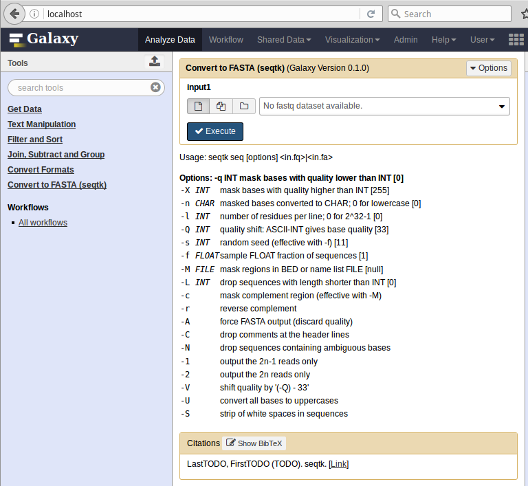

Publishing to the Tool Shed
===========================

Now that the tool is working and useful - it is time to publish it to the Tool
Shed. The `Galaxy Tool Shed`_ (referred to colloquially in Planemo as the
"shed") can store Galaxy tools, dependency definitions, and workflows among
other Galaxy artifacts. Shed's goal is to make it easy for any Galaxy to install these.

Configuring a Tool Shed Account
-------------------------------

The `planemo <http://planemo.readthedocs.org/en/latest/appliance.html>`__
appliance comes pre-configured with a local Tool Shed and Planemo is
configured to talk to it via ``~/.planemo.yml`` configuration file.
Check out the `publishing docs <http://planemo.readthedocs.org/en/latest/publishing.html>`__
for information on setting up this file on your development environment.

Creating a Repository
---------------------

Planemo can be used to publish "repositories" to the Tool Shed. A
single GitHub repository or locally managed directory of tools may correspond
to any number of Tool Shed repositories. Planemo maps files to Tool Shed
repositories using a special file called ``.shed.yml``.

From a directory containing tools the ``shed_init``
`command <http://planemo.readthedocs.org/en/latest/commands.html#shed-init-command>`__
can be used to bootstrap a new ``.shed.yml`` file.

::

    $ planemo shed_init --name=seqtk_seq \
                        --owner=planemo \
                        --description=seqtk_seq \
                        --long_description="Tool that converts FASTQ to FASTA files using seqtk" \
                        --category="Fastq Manipulation"

The resulting ``.shed.yml`` file will look something like this:

.. code-block:: yaml

  categories: [Fastq Manipulation]
  description: seqtk_seq
  long_description: Tool that converts FASTQ to FASTA files using seqtk
  name: seqtk_seq
  owner: planemo

There is not a lot of magic happening here, this file could easily be created
directly with a text editor - but the command has a ``--help`` to assist you
and does some very basic validation. More information on ``.shed.yml``
can be found as part of the IUC's `best practice documentation
<http://galaxy-iuc-standards.readthedocs.org/en/latest/best_practices/shed_yml.html>`__.

This configuration file and shed artifacts can be quickly linted using the following command.

::

    $ planemo shed_lint --tools

Once the details in the ``.shed.yml`` are set and it is time to create the remote
repository and upload artifacts to it - the following two commands can be used
- the first only needs to be run once and creates the repository based on the
metadata in ``.shed.yml`` and the second uploads your actual artifacts to it.

::

    $ planemo shed_create --shed_target local
    Repository created
    cd '/opt/galaxy/tools' && git rev-parse HEAD
    Repository seqtk_seq updated successfully.

You can now navigate to the local shed (likely at `http://localhost:9009/
<http://localhost:9009/>`__) and see the repository there.
Optionally you can login with username ``planemo@test.com``
and password ``planemo`` but it is not necessary.

Updating a Repository
---------------------

In order to push further changes in your local tool development directory
to the shed you would run the ``shed_update`` command as follows.
::

    $ planemo shed_update --shed_target local

Serving a Tool from Shed
------------------------

Once tools (and possible required dependency files) have been published,
the whole thing can be automatically installed and the tool served in local
Galaxy using this command.

::

    $ planemo shed_serve --shed_target local

.. note:: During this tutorial we did not "teach" Galaxy how to obtain
  the seqtk software so our tool (and thus Galaxy) just expects the command
  ``seqtk`` to be available. The seqtk software here is a so called ``dependency``
  of our tool and in order for our tool to be fully installable we need to
  create a "recipe" for Galaxy so it knows how to obtain it. This is covered
  in other sections of this documentation as well as on the
  `wiki <https://wiki.galaxyproject.org/ToolShedToolFeatures>`__.

Main Tool Shed
--------------

Once your artifacts are ready for publication to the Main Tool Shed, the
following command creates a repository there and populates it with your contents.

::

    $ planemo shed_create --shed_target toolshed

The planemo machine isn't preconfigured to allow publishing to the `Main Tool
Shed <https://toolshed.g2.bx.psu.edu/>`__ so this command will not work here. See the more complete `publishing docs
<http://planemo.readthedocs.org/en/latest/publishing.html>`__ for full details
about how to setup Planemo to publish to the Main and Test Tool Shed - the
process is very similar.

.. _Galaxy Tool Shed: https://toolshed.g2.bx.psu.edu/
.. _Tool Shed Wiki: https://wiki.galaxyproject.org/ToolShed
.. _package definition: https://wiki.galaxyproject.org/PackageRecipes
.. _`tools-iuc`: https://github.com/galaxyproject/tools-iuc
