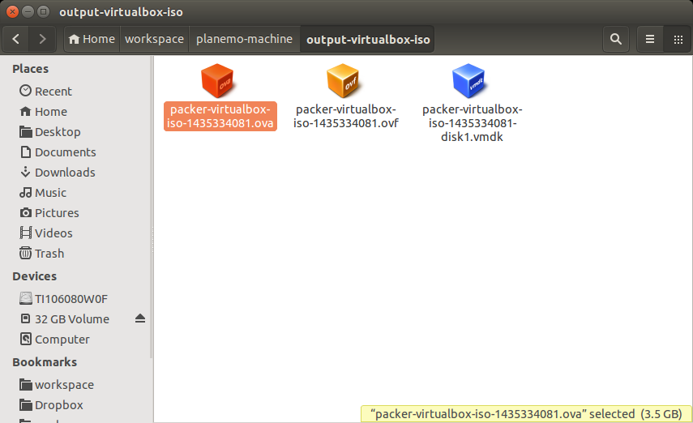
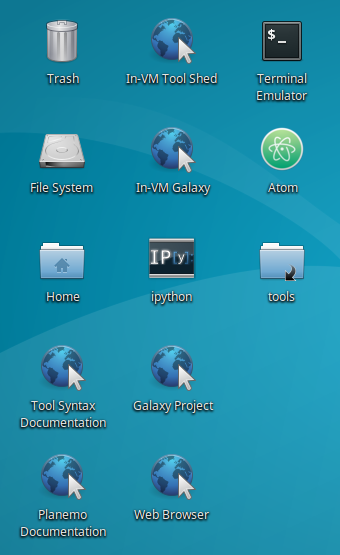
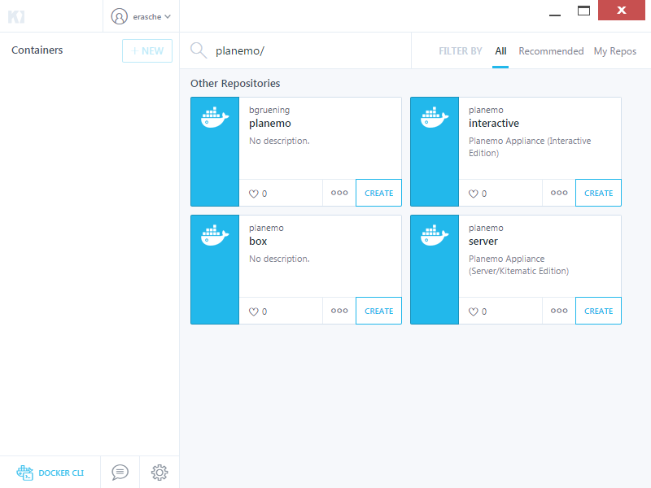
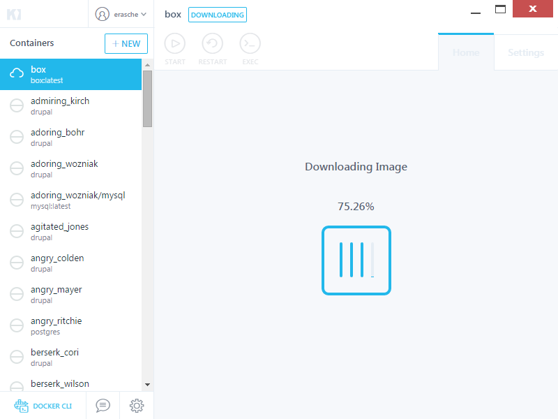
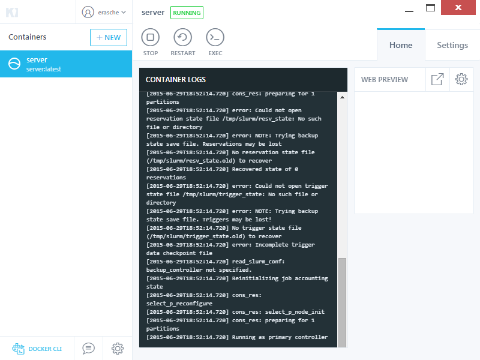
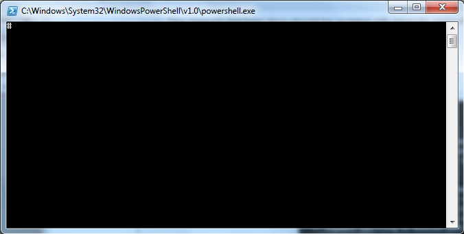

==================
Virtual Appliance
==================

You can use Planemo as part of a Galaxy tool development virtual
appliance which comes pre-configured with Planemo, Galaxy_, Docker_, Conda_,
a local Tool Shed, linuxbrew_, Komodo_ and Atom_ editors.

Quick Links
-----------
If you already know what to do. Otherwise please read on.

* Planemo OVA image: https://images.galaxyproject.org/planemo/latest.ova
* ``docker run -p 8010:80 -p 9009:9009 -v `pwd`:/opt/galaxy/tools -i -t planemo/interactive``
  This assumes your tools are in your current working directory
  (replace `\`pwd\`` with a path to your tools if this is not the case).

The Setup
---------
The Galaxy instance that runs in these appliances has been optimized for tool
development - Galaxy will monitor your tool directory for changes and reload
the tools as they are modified, the server will directly log you into Galaxy
as an admin (no need to worry about user management or configuration), Galaxy
is configured to use a `PostgreSQL
<http://www.postgresql.org/>`_ database, and execute jobs via `SLURM
<https://computing.llnl.gov/linux/slurm/>`_ for robustness. If something goes
wrong and Galaxy needs to be restarted manually - run ``restart_galaxy``
from the command-line.

The virtual appliance is available in four flavors via open virtualization
format (OVA_, .ova), Docker, Vagrant, and as a Google Compute Engine cloud image.

The OVA image is a stable way to boot a Planemo virtual
machine on any platform and comes with a pre-configured Xubuntu-based windowed
operating system with graphical editing tools including Komodo_ and Atom_ editors.
This approach can be thought of more as a complete
environment and may be better for tutorials and workshops where consistent user
experience is more important.

The Docker and Vagrant versions make it trivial to mount an external directory
in the appliance so that one can use their own development tools (such as
editors). These can be used in traditional development environments with existing
tools and will probably be the preference of power users whereas.

The Google Compute Engine variant is ideal when
local compute resources are unavailable or insufficient.

Launching the Appliance
-----------------------
The following sections will describe how to launch the appliance using various platforms.

Launching the Appliance (VirtualBox - OVA)
================================================

The VirtualBox OVA variant of the Planemo appliance comes preconfigured with
a full windowed development environment (based on Xubuntu). Encompassing the
complete environment means it is easier to setup and provides an identical
experience for every developer using it. These make the OVA image ideal
for tutorials and workshops.

The latest VirtualBox version of the planemo appliance can be found `here
<https://images.galaxyproject.org/planemo/latest.ova>`__.

Please download and install VirtualBox_.
When VirtualBox has been installed - the planemo machine can be imported by
downloading the latest image and double clicking the resulting file. This should
result in VirtualBox being opened to an import screen. Just follow the prompt
and the machine should become available.

.. image:: images/ova_import.png
   :alt: Screenshot OVA Import

.. image:: images/ova_importing.png
   :alt: Screenshot OVA Import

When the import is finished (and before starting the VM), right-click on the new appliance and select "Settings":

1. in the "General" -> "Advanced" tab, select "Bidirectional" for "Shared Clipboard"
2. in the "Display" -> "Screen" tab, tick "Enable 3D Acceleration"
3. in the "Network" -> "Adapter 1" tab, select "PCnet-FAST III (Am79c973)" as "Adapter Type"
4. Click the "OK" button

Now start the appliance by clicking the "Start" button.

The Firefox browser, Komodo_ and Atom_ editors, Galaxy, Planemo and everything else is
available right away on the desktop along with useful links.

In-VM Galaxy runs at `http://localhost <http://localhost>`__ and the In-VM Tool Shed
at `http://localhost:9009 <http://localhost:9009>`__.

Various relevant applications are available under the Xubuntu menu which has
the following icon.

Launching the Appliance (Docker)
==================================

There are two variants of the Docker appliance - one is specifically designed
for Kitematic_ a GUI application available for Mac OS X and Windows that
claims to be "the easiest way to start using Docker" and the other is designed
to be used with a command-prompt available under Linux or in Mac OS X and Windows
when using boot2docker_.

~~~~~~~~~~~~~~~~~~~~~~~~~~~~~~~~
Server Edition (for Kitematic)
~~~~~~~~~~~~~~~~~~~~~~~~~~~~~~~~

To get started with Kitematic, please `download it
<https://kitematic.com/download>`__ if it hasn't been
previously installed and then launch it.

Wait for Kitematic_ to load and search for `planemo/server`.

Once Kitematic_ has downloaded, you can use the search bar at the top to locate `planemo/server`

There may be several Planemo containers discovered  - be sure to pick the
`planemo/server` one with the experience optimized for Kitematic_. Choose to
create this image and it will download.

After a minute or so, you should see logs for the running
container appear in the main window.

Galaxy will now be available by clicking the link in the `Web Preview` section
of the GUI.

Clicking the `Exec` button in the container's tool bar (at the
top, middle of the screen) will launch a root command-prompt. Planemo is
configured for the ``ubuntu`` user - so the first thing you should do is
launch an ``ubuntu`` login session by entering the command ``su - ubuntu``.

.. image:: images/kitematic_ubuntu_prompt.png
   :alt: Screenshot Kitematic ubuntu prompt

~~~~~~~~~~~~~~~~~~~~~~~~~~~~~~~~
Interactive Edition
~~~~~~~~~~~~~~~~~~~~~~~~~~~~~~~~

The interactive edition of the Planemo Docker image is designed for
environments where the ``docker`` command-line tool is available. This can
easily be installed via package managers under Linux - but for Windows and Mac
OS X - boot2docker_ should be installed and launched in order to run these
commands.

The `Docker`_ version of the planemo appliance can be launched using the
following command (which will pull the appliance down from `Docker Hub
<https://registry.hub.docker.com/u/planemo/interactive/>`_).

::

    $ docker run -p 8010:80 -p 9009:9009 -v `pwd`:/opt/galaxy/tools -i -t planemo/interactive

This command will start Galaxy and various other services and then open a bash
shell with Planemo available. This assumes your tools are in your current
working directory (just replace `\`pwd\`` with a path to your tools if this is
not the case).

Docker commands such as ``ps`` and ``kill`` can be used to manage this Docker
container.

This Docker environment will contain your tools and modifications made to them
will be made directly to your filesystem - so they are persistent. Data loaded
into the Galaxy instance (history data for instance) will be lost when the
Docker container is stopped. Check out the `docker-galaxy-stable
<https://github.com/bgruening/docker-galaxy-stable>`_ project for information
on running persistent Galaxy processes in Docker.

Launching the Appliance (Vagrant)
==================================
*The image for this way of launching the appliance is outdated. Please use a different one.*

The latest `Vagrant`_ version of the planemo appliance can be found
`here <https://images.galaxyproject.org/planemo/latest.box>`__. Once you have
installed `Vagrant`_ (`download now <http://www.vagrantup.com/downloads>`_),
the appliance can be enabled by first creating a ``Vagrantfile`` in your tool
directory - the following demonstrates an example of such file.

.. literalinclude:: Vagrantfile
   :language: ruby

This file must literally be named ``Vagrantfile``. Next you will need to
startup the appliance. This is as easy as

::

  $ vagrant up

Once the virtual server has booted up completely, Galaxy will be available at
`http://localhost:8010 <http://localhost:8010>`__, the Codebox_ IDE will be
available `http://localhost:8010/ide/ <http://localhost:8010/ide/>`__, and the
local Tool Shed at `http://localhost:9009 <http://localhost:9009>`__.

Launching the Appliance (Google Compute Engine)
===============================================
*The image for this way of launching the appliance is outdated. Please use a different one.*

The `GCE`_ version of the appliance is different in that it doesn't run locally
on your computer, but on a remote 'cloud' machine.  Using this variant of the
appliance requires a `Google Cloud Platform <https://cloud.google.com>`_
account with an active payment method.

The first thing you'll want to do is get the gcloud_ administration utility
installed and configured.  Once you've installed gcloud, you can authenticate
and (optionally) set your default project, zone, and region (example below, but
you should choose whatever region and zone are appropriate for your location).
If you set these defaults, you will not have to supply them to all subsequent
commands.

::

    $ gcloud auth login
    $ gcloud config set project YOUR-PROJECT-NAME
    $ gcloud config set compute/region us-central1    (replace us-central1 with another region if desired)
    $ gcloud config set compute/zone us-central1-f    (same for the zone us-central1-f)

Import the image to your account with the following statement.  This will only
need to be done one time, unless you delete the image from your account.

::

    $ gcloud compute images create planemo-machine --source-uri=http://storage.googleapis.com/galaxyproject_images/planemo_machine.image.tar.gz

To launch the image as a fresh instance, use the following command.  This
command will, upon completion, display an external ip address that you can
navigate to in your web browser.

::

    $ gcloud compute instances create planemo --machine-type n1-standard-2 --image planemo-machine --tags http-server

If you'd like to SSH in to the instance at this point, it's easy to do with:

::

    $ gcloud compute ssh planemo

Building the Appliance
----------------------

These appliances are built using the `planemo-machine
<https://github.com/jmchilton/planemo-machine>`_ project which can be used to
build customized recipes of this nature or even appliance for cloud
environments such as Amazon Web Services and Google Compute Engine.

.. _Galaxy: http://galaxyproject.org/
.. _Docker: https://www.docker.com/
.. _Conda: http://conda.pydata.org/
.. _linuxbrew: https://github.com/Homebrew/linuxbrew
.. _Vagrant: https://www.vagrantup.com/
.. _Codebox: https://www.codebox.io/
.. _GCE: https://cloud.google.com/compute/
.. _gcloud: https://cloud.google.com/sdk/gcloud/
.. _Vagrant: https://www.vagrantup.com/
.. _VirtualBox: https://www.virtualbox.org/wiki/Downloads
.. _Komodo: http://komodoide.com/komodo-edit/
.. _Kitematic: https://kitematic.com/
.. _boot2docker: http://boot2docker.io/
.. _OVA: https://en.wikipedia.org/wiki/Open_Virtualization_Format
.. _Atom: https://atom.io/

