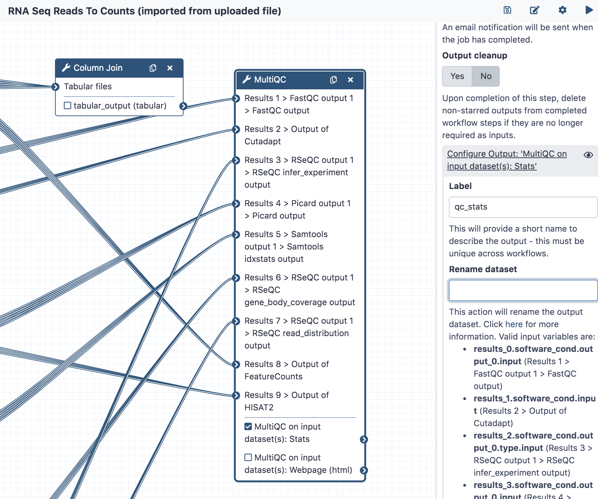
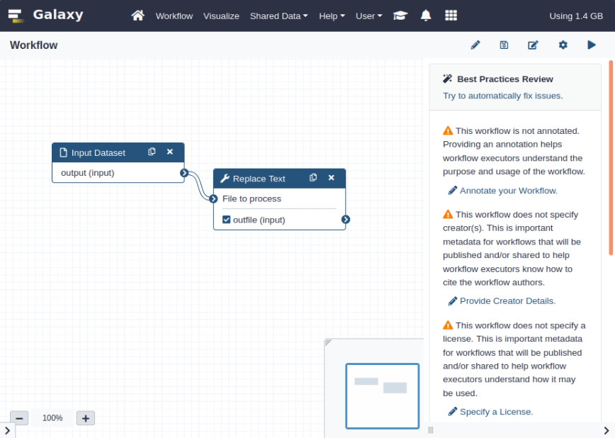

Best Practices for Maintaining Galaxy Workflows
===============================================

There are a number of things the user interface of Galaxy will allow that are not
considered best practices because they make the workflow harder to test, use within
subworkflows and invocation reports, and consume via the API. It is easier to use
workflows in all of these contexts if they stick to the best practices discussed
in this document.

Many of these best practices can be checked with Planemo using the follow command:

::

    $ planemo workflow_lint path/to/workflow.ga

If ``workflow_lint`` is sent a directory, it will scan the directory for workflow
artifacts - including Galaxy workflows and Dockstore ``.dockstore.yml`` files that
register Galaxy workflows.

Workflow Structure
------------------

Outputs
~~~~~~~

Workflows should define explicit, labelled outputs. Galaxy doesn't require you to
declare outputs explicitly or label them - but doing so provides a lot of advantages.
A workflow with declared, labelled outputs specifies an explicit interface that is
much easier to consume when building a report for the workflow, testing the workflow,
using the workflow via the API, and using the workflow as a subworkflow in Galaxy.

The above screenshot demonstrates a MultiQC node with its stats output marked as an
output and labelled as ``qc_stats``.

.. note:: The Galaxy workflow editor will help you ensure that workflow output labels
   are unique across a workflow. Also be sure to add labels to your outputs before
   using a workflow as a subworkflow in another workflow so less stable and less
   contextualized step indicies and tool output names don't need to be used.

Inputs
~~~~~~

Similarly to outputs and for similar reasons, all inputs should be explicit (with
labelled input nodes) and tool steps should not have disconnected data inputs (even
though the GUI can handle this) or consume workflow parameters. Older style "runtime
parameters" should only be used for post job actions and newer type workflow parameter
inputs should be used to manipulate tool logic.

.. figure:: https://training.galaxyproject.org/training-material/topics/galaxy-interface/images/workflow_integer_param.gif
   :alt: Screenshot of using workflow inputs in Galaxy workflow editor

A `full tutorial <https://training.galaxyproject.org/training-material/topics/galaxy-interface/tutorials/workflow-parameters/tutorial.html>`__
on building Galaxy workflows with newer explicit workflow parameters can be found as
part of the Galaxy Training Network.

In addition to making the interface easier to use in the context of subworkflows,
the API, testing, etc.. future enhancements to Galaxy will allow a much simpler
UI for workflows that only use explicit input parameters in this fashion.

https://github.com/galaxyproject/galaxy/pull/9151

Tools
~~~~~

The tools used within a workflow should be packaged with Galaxy by default or published
to the main Galaxy ToolShed. Using private tool sheds or the test tool shed limits the
ability of other Galaxy's to use the workflow.

Syntax
~~~~~~

Planemo's ``workflow_lint`` also checks if workflows have the correct JSON or YAML syntax,
and ensures workflows follow certain 'best practices'. Best practices can also be checked
in the 'Workflow Best Practices' panel of Galaxy's workflow editor and to some extent
automatically fixed.

The ``workflow_lint`` subcommand allows the same checks to be made via the command line;
this may be less of a problem for workflows exported from a Galaxy instance but can assist
with workflows hand-edited or implemented using the newer YAML gxformat2 syntax.

::

    $ planemo workflow_lint path/to/workflow.ga

Running this command makes the following checks:

* The workflow is annotated
* The workflow specifies a creator
* The workflow specifies a license
* All workflow steps are connected to formal input parameters
* All workflow steps are annotated and labelled
* No legacy 'untyped' parameters are used, e.g. a variable such as `${report_name}` in an input field
* All outputs are labelled.

In addition to checking the structure of the JSON or YAML file and workflow best practices,
``workflow_lint`` also checks the workflow test file is formatted correctly and at least one
valid test is specified.

Tests
-----

Writing workflow tests allows consumers of your workflow to know it works in their
Galaxy environment and can allow for richer continuous integration (CI). Check out
the `Planemo Test Format <http://planemo.readthedocs.io/en/latest/test_format.html>`__
documentation for more information on the format and how to test workflows with Planemo.

Planemo can help you stud out tests for a workflow developed within the UI quickly
with the ``workflow_test_init`` command.

::

    $ planemo workflow_test_init path/to/workflow.ga

This command creates a template test file, with inputs, parameters and expected outputs
left blank for you to fill in. If you've already run the workflow on an external Galaxy
server, you can generate a more complete test file directly from the invocation ID using
the ``--from_invocation`` option.

::

    $ planemo workflow_test_init --from_invocation <INVOCATION ID> --galaxy_url <GALAXY SERVER URL> --galaxy_user_key" <GALAXY API KEY>

You also need to specify the server URL and your API key, as Galaxy invocation IDs are
only unique to a particular server. You can obtain the invocation ID from
``<GALAXY SERVER URL>/workflows/invocations``.

Publishing
----------

Unlike with Galaxy tools - the Galaxy team doesn't endorse a specific registry for
Galaxy workflows. But also unlike Galaxy tools, any user can just paste a URL for
a workflow right into the user interface so sharing a workflow can be as easy as
passing around a GitHub link.

Github
~~~~~~

Even if you're publishing your workflows to other registries or website, we always
recommend publishing workflows to Github (or a publicly available Gitlab server).

Dockstore
~~~~~~~~~

A repository containing Galaxy workflows and published to GitHub can be registered
with `Dockstore <https://dockstore.org/>`__. This allows others to search for the
workflow and access it using standard GA4GH APIs. In the future, deep bi-directional
integration between Galaxy and Dockstore will be available that will make these
workflows even more useful.

A ``.dockstore.yml`` file should be placed in the root of your workflow repository before
registering the repository with Dockstore. This will allow Dockstore to find your workflows
and their tests automatically.

Planemo can create this file for you by executing the ``dockstore_init`` command from
the root of your workflow repository

::

    $ planemo dockstore_init

Planemo's ``workflow_lint`` will check the contents of your ``.dockstore.yml`` file during
execution if this file is present.

Workflow Hub
~~~~~~~~~~~~

Information on uploading workflows to `workflowhub.eu <https://workflowhub.eu/>`__ can be found
`here <https://about.workflowhub.eu/How-to-register-your-workflow(s)-in-WorkflowHub/>`__.
